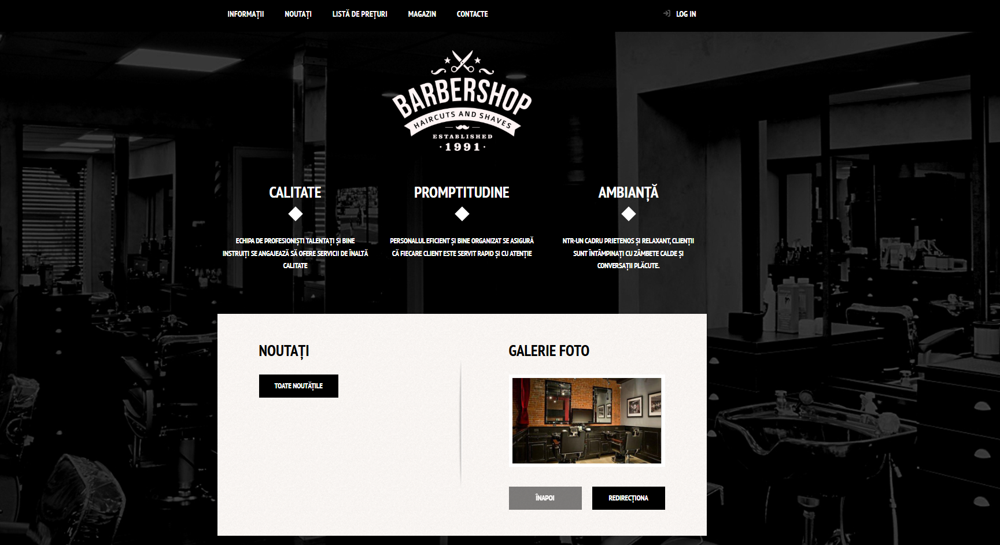

# Barbershop Web Application

## Overview
This is a simple web presentation site for a barbershop. Users can view available services and make online appointments. The project was developed collaboratively: frontend was done by my colleague, and I implemented the backend using PHP.

## Features
- Showcase services and barbers
- Online appointment form
- Backend handles form submissions
- Responsive and user-friendly interface (frontend by colleague)

## Technologies Used
- **Backend:** PHP
- **Frontend:** HTML, CSS, JavaScript
- No database included

## Usage
1. Copy the project folder to `htdocs` in XAMPP.  
2. Open in browser: `http://localhost/barbershop-app`.  
3. Fill out the appointment form to test backend functionality.

## Notes
- Purely a presentation website with basic backend functionality.  
- Collaboration: frontend by my colleague, backend by me.

## Screenshot

### Home Page

*Welcome page of the Barbershop website.*
